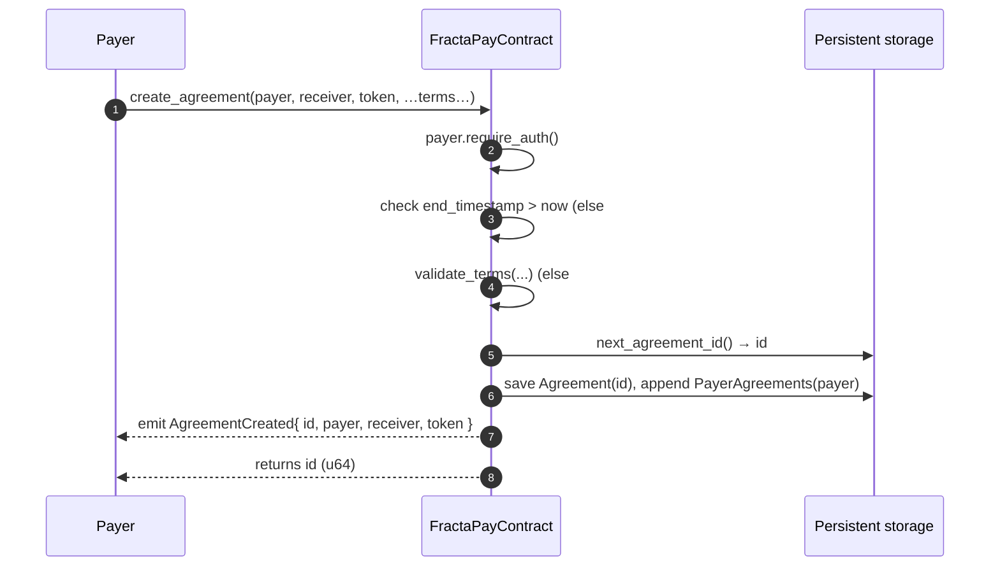
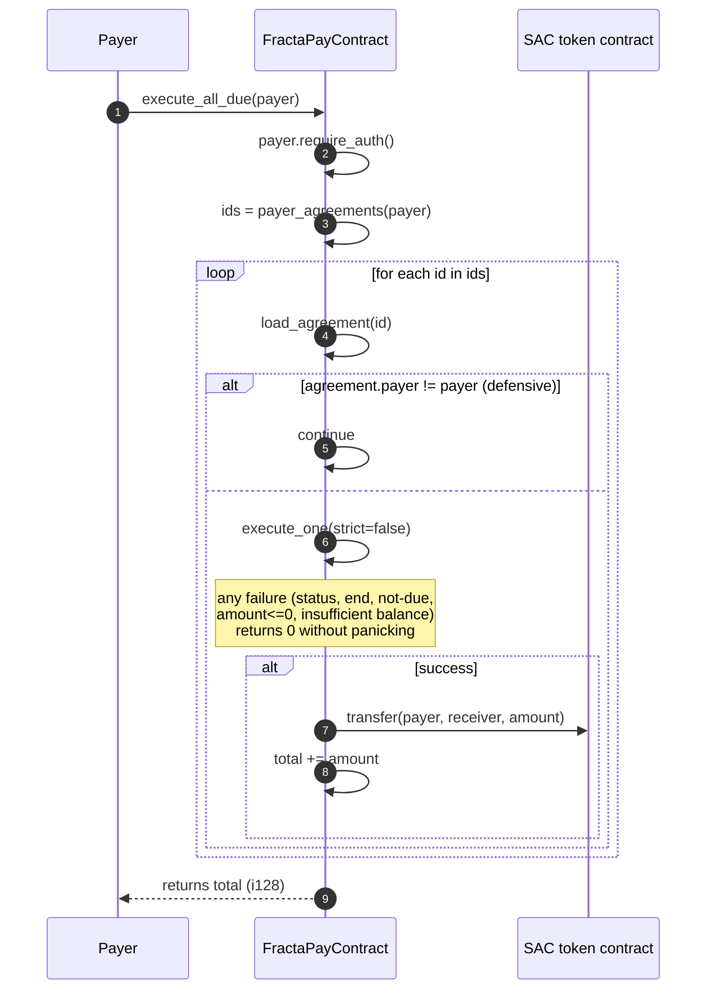
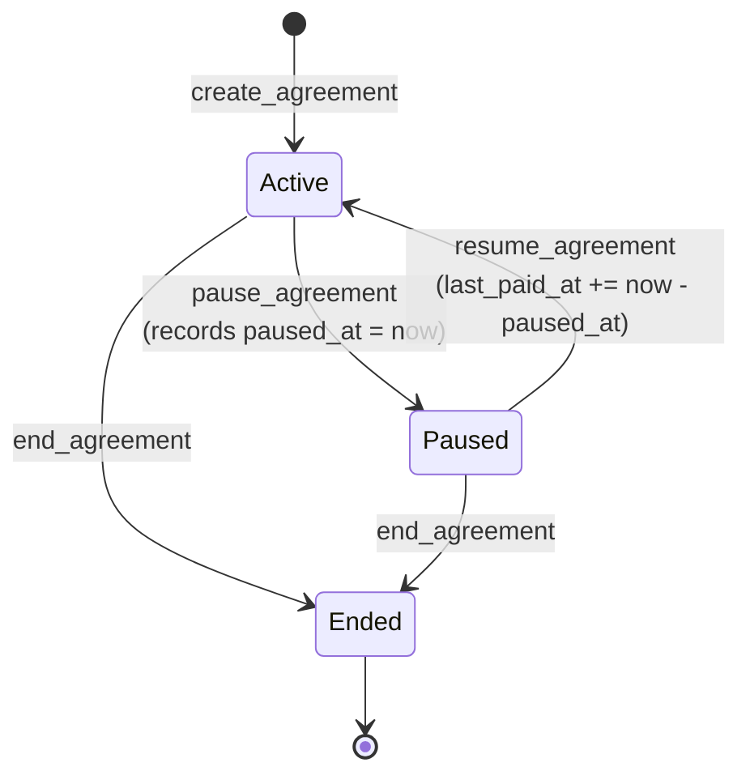
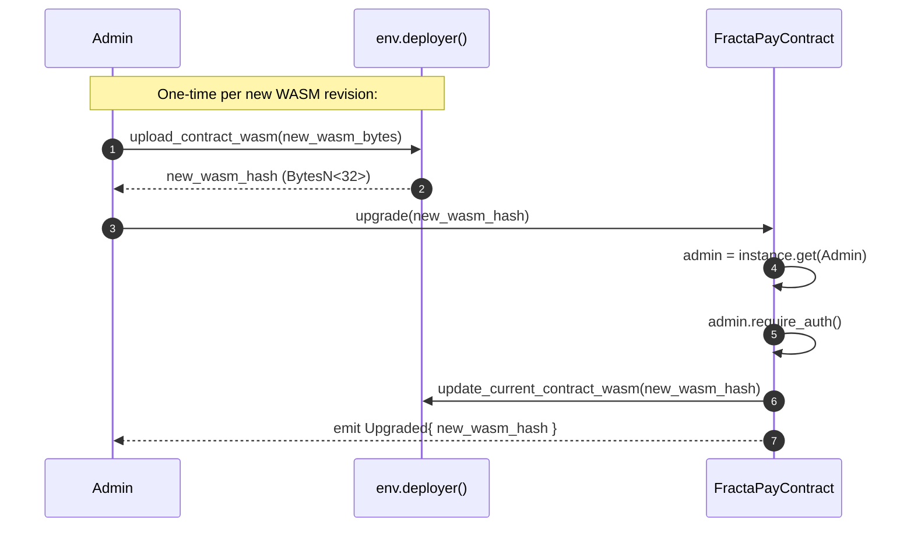

# FractaPay Contract — User Flow

> **Audience:** developers integrating the FractaPay Soroban contract from server or web.
> **Contract version:** `0.4.0` (direct payer-wallet debit; no escrow pool).
> **Source of truth:** [`contracts/src/lib.rs`](../contracts/src/lib.rs). Static reference (storage tiers, full event/error tables) lives in [`CLAUDE.md`](../CLAUDE.md) under "Contract internals" — this document covers the *flow*, not the schema.

---

## 1. Overview

### Actors

| Actor | Role | Auth |
|---|---|---|
| **Admin** | Initialized by `__constructor`. Only authority that can `upgrade` the WASM. | `admin.require_auth()` for `upgrade` only. |
| **Payer** | Owns the wallet that funds payments. Creates and manages agreements. | `payer.require_auth()` on every mutating call where the payer is involved. |
| **Receiver** | Passive. Receives tokens via SAC `transfer` at execution time. | None. Never signs. |
| **FractaPayContract** | Holds the agreement state. Does **not** hold token balances. | Does not auth as itself. |
| **SAC token contract** | Stellar Asset Contract (or any SEP-41 token). Executes the actual `transfer(payer, receiver, amount)`. | Re-checks `payer.require_auth()` — covered by the caller's auth tree on `execute_*`. |

### Invariants

- **Direct debit, no escrow.** Tokens stay in the payer's wallet until the moment of execution. The contract never custodies funds.
- **`receiver` and `token` are immutable post-create.** To switch either, the payer must `end_agreement` and create a new one.
- **Pause shifts; does not skip.** `pause_agreement` + `resume_agreement` adds the paused duration to `last_paid_at` so no cycles are lost — only delayed.
- **`execute_all_due` is order-sensitive when the wallet is short.** Agreements pay in `PayerAgreements` insertion order until the payer's balance drops below the next amount; remainder skip silently.
- **One signature covers two auth checks on execute.** `agreement.payer.require_auth()` (contract-level) and the SAC `transfer(from, …)` auth (token-level) are satisfied by the same payer signature in the same transaction's auth tree.

---

## 2. Deployment & initialization

```bash
cd contracts
make build                     # produces target/wasm32v1-none/release/fractapay.wasm
make deploy-testnet            # uses the stellar CLI; admin address is supplied via the deploy script
```

On deploy, `__constructor(admin: Address)` runs once:

- Writes `DataKey::Admin = admin` to **instance storage**.
- Writes `DataKey::NextAgreementId = 0` to instance storage.

Confirm the deploy by calling `version()` — must return `"0.4.0"`.

---

## 3. Agreement creation

`create_agreement(payer, receiver, token, contract_type, flat_amount, percent_bps, reference_amount, frequency, end_timestamp) -> u64`

The payer commits the recurring terms. Returns the new agreement's `u64` id (auto-increment from `NextAgreementId`).



**Panic surface:**

| Code | Trigger |
|---|---|
| `#5 InvalidWindow` | `end_timestamp <= now` |
| `#6 InvalidAmount` | `flat_amount < 0` or `reference_amount < 0`; `flat_amount == 0` for `Flat`/`Mix` |
| `#7 InvalidBps` | `percent_bps > 10_000`; or `percent_bps == 0` for `Royalties`/`Mix` |

`contract_type` determines the payment formula:

| ContractType | Amount per cycle |
|---|---|
| `Flat` | `flat_amount` |
| `Royalties` | `reference_amount * percent_bps / 10_000` |
| `Mix` | `flat_amount + reference_amount * percent_bps / 10_000` |

`frequency` is one of `Weekly | Biweekly | Monthly | Quarterly | Yearly | Custom(u64 seconds)`.

---

## 4. Funding the payer wallet (no `deposit` call)

There is no `deposit` method. The payer simply needs to hold enough of the agreement's `token` in their own wallet at execute time.

**Recommended server-side pre-flight before triggering `execute_*`:**

```ts
const tokenClient = new Contract(tokenAddress);
const balance = await tokenClient.call('balance', payerAddress);
if (balance < dueAmount) {
  // surface "top up wallet" UX; do not submit the execute tx
}
```

This avoids the `#8 InsufficientBalance` panic that would otherwise revert the transaction (strict path) or silently skip the agreement (batch path).

---

## 5. Single execution — `execute_due_payment(id) -> i128`

Strict path. Panics on every failure mode. Returns the amount paid.

```mermaid
sequenceDiagram
    autonumber
    participant Caller as Caller (any account)
    participant C as FractaPayContract
    participant SAC as SAC token contract
    participant R as Receiver

    Caller->>C: execute_due_payment(id)
    C->>C: load_agreement(id)  (panic #1 if missing)
    C->>C: agreement.payer.require_auth()
    Note over C: now in execute_one(strict=true)
    C->>C: status == Active?           (else #9)
    C->>C: now <= end_timestamp?       (else #4)
    C->>C: now >= last_paid_at + interval?  (else #3)
    C->>C: amount = compute_payment_amount(agreement)
    C->>SAC: balance(payer)
    SAC-->>C: payer_balance
    C->>C: payer_balance >= amount?    (else #8)
    C->>SAC: transfer(payer, receiver, amount)
    SAC->>R: credit amount
    SAC-->>C: ok
    C->>C: agreement.last_paid_at = now; last_amount_paid = amount
    C->>C: append PaymentHistory(payer, record)
    C-->>Caller: emit PaymentExecuted{ id, payer, receiver, token, amount }
    C-->>Caller: returns amount (i128)
```

**Panic surface:**

| Code | Trigger |
|---|---|
| `#1 AgreementNotFound` | id never created |
| `#3 PaymentNotDue` | `now < last_paid_at + interval` |
| `#4 AfterEnd` | `now > end_timestamp` |
| `#6 InvalidAmount` | computed amount `<= 0` (would only happen on a misconfigured Royalties with `reference_amount * bps < 10_000`) |
| `#8 InsufficientBalance` | `token.balance(payer) < amount` |
| `#9 WrongStatus` | agreement is `Paused` or `Ended` |

**Note on auth:** the *caller* of `execute_due_payment` does not need to be the payer — anyone can trigger the call — but the transaction's auth tree must contain `agreement.payer`'s signature, because both the contract and the SAC `transfer` require it.

---

## 6. Batch execution — `execute_all_due(payer) -> i128`

Non-strict. Iterates the payer's agreements, skipping any that fail any check. Returns the **sum** of amounts actually paid.



**Order sensitivity.** Agreements pay in `PayerAgreements` insertion order (= creation order). When the payer's balance drops below the next agreement's amount, that agreement and all subsequent ones in the loop are skipped. Plan creation order accordingly if a payer is likely to be cash-constrained.

**No panic from this method** under normal use. (`load_agreement` could panic `#1` if storage is corrupted, but that is an invariant violation, not a flow.)

---

## 7. Reads

All reads are auth-free and side-effect-free except for TTL extension on the underlying storage entry.

| Method | Returns | Notes |
|---|---|---|
| `version() -> String` | `"0.4.0"` | |
| `get_admin() -> Address` | constructor admin | |
| `get_due_payments(payer) -> Vec<DuePayment>` | `{id, amount}` for every Active, in-window, past-due agreement | Empty `Vec` if none. Use as the source of truth for "what would `execute_all_due` actually pay right now". |
| `get_agreement(id) -> Agreement` | full agreement record | **Only read that panics** — `#1 AgreementNotFound` if id never existed. |
| `get_payer_agreements(payer) -> Vec<u64>` | all ids the payer has ever created | Empty `Vec` if never created any. |
| `get_payment_history(payer) -> Vec<PaymentRecord>` | append-only execution log | Empty `Vec` if never paid. Grows unbounded — pagination is a known TODO. |

---

## 8. Lifecycle — `pause_agreement` / `resume_agreement` / `end_agreement`



| Transition | Allowed from | Panic if invalid |
|---|---|---|
| `pause_agreement(id)` | `Active` only | `#9 WrongStatus` |
| `resume_agreement(id)` | `Paused` only | `#9 WrongStatus` |
| `end_agreement(id)` | `Active` or `Paused` (anything not already `Ended`) | `#9 WrongStatus` |

All three require `agreement.payer.require_auth()`. Each emits a corresponding event (`AgreementPaused`, `AgreementResumed`, `AgreementEnded`).

**Pause/resume math.** If you pause for 10 days mid-cycle, the next due timestamp is pushed out by exactly 10 days. No cycles are skipped — they just slide.

---

## 9. Reference updates — `set_reference(id, reference_amount)`

For `Royalties` or `Mix` agreements, the reference value (the basis for the percentage cut) is mutable.

- `agreement.payer.require_auth()`
- Panic surface: `#6 InvalidAmount` if `reference_amount < 0`; `#9 WrongStatus` if the agreement is `Ended`.
- Emits `AgreementEdited { id }`.

The new value applies on the *next* execution; in-flight cycles are not retroactively recomputed.

---

## 10. Term edits — `edit_agreement(id, contract_type, flat_amount, percent_bps, reference_amount, frequency, end_timestamp)`

Replaces all mutable terms in one call.

**Immutable:** `payer`, `receiver`, `token`, `last_paid_at`, `last_amount_paid`, `status`, `paused_at`. To switch `receiver` or `token`, end the agreement and create a new one.

Validation matches `create_agreement`: same `validate_terms` panic surface (`#5`/`#6`/`#7`). Also panics `#9 WrongStatus` if the agreement is `Ended`.

Emits `AgreementEdited { id }`.

---

## 11. Admin / upgrade flow



**Two-step requirement.** `upgrade` only swaps the code pointer — it does **not** ship the bytes. Upload the bytes via `env.deployer().upload_contract_wasm(...)` first (typically from a deploy script using the stellar CLI) so that `new_wasm_hash` resolves to a registered WASM. Calling `upgrade` with an unregistered hash panics.

---

## 12. Auth model summary

| Method | Whose `require_auth` is called | Notes |
|---|---|---|
| `__constructor` | — | Runs once at deploy. |
| `get_admin`, `version` | — | Read-only. |
| `upgrade(hash)` | **admin** (loaded from instance storage) | Not the caller. |
| `create_agreement(payer, …)` | **payer** (param) | |
| `edit_agreement(id, …)` | **agreement.payer** (loaded) | Not the caller. |
| `set_reference(id, …)` | **agreement.payer** | |
| `pause_agreement(id)` | **agreement.payer** | |
| `resume_agreement(id)` | **agreement.payer** | |
| `end_agreement(id)` | **agreement.payer** | |
| `execute_due_payment(id)` | **agreement.payer** | + SAC `transfer` re-checks payer auth, same tree. |
| `execute_all_due(payer)` | **payer** (param) | Covers all agreements + all SAC transfers in one signature. |
| `get_due_payments`, `get_agreement`, `get_payer_agreements`, `get_payment_history` | — | Read-only. |

**Caller vs. stored payer.** For all `*_agreement` and `execute_*` methods, the *signer* must be the payer recorded on the agreement, regardless of who submits the transaction. A relayer can pay the gas, but the payer's signature is still required in the auth tree.

---

## 13. Error code reference

| Code | Variant | Raised by | Meaning |
|---|---|---|---|
| 1 | `AgreementNotFound` | every method that calls `load_agreement(id)` | The id was never created (or storage entry expired without re-extension). |
| 2 | `NotPayer` | — | **Reserved, never raised.** `require_auth` covers caller-identity checks. |
| 3 | `PaymentNotDue` | `execute_due_payment` strict path | `now < last_paid_at + interval`. Call `get_due_payments` to find what is actually ready. |
| 4 | `AfterEnd` | `execute_due_payment` strict path | `now > agreement.end_timestamp`. The agreement window has closed; consider `end_agreement`. |
| 5 | `InvalidWindow` | `create_agreement`, `edit_agreement` | `end_timestamp <= now`. Must be a future ledger timestamp. |
| 6 | `InvalidAmount` | `validate_terms`, `set_reference`, `execute_one` (amount ≤ 0) | A required amount is negative or zero. |
| 7 | `InvalidBps` | `validate_terms` | `percent_bps > 10_000`, or `0` where required by `Royalties`/`Mix`. |
| 8 | `InsufficientBalance` | `execute_due_payment` strict path | `token.balance(payer) < amount`. Top up the payer wallet. |
| 9 | `WrongStatus` | `edit_agreement`, `set_reference`, `pause/resume/end_agreement`, `execute_*` | Lifecycle transition or action not legal in the current `Status`. |
| 10 | `ReferenceRequired` | — | **Reserved, never raised.** Validation precludes it. |

Test assertions use the exact panic string `"Error(Contract, #N)"`. Match on that prefix from client-side error parsers.

---

## 14. End-to-end happy path

A single annotated trace of the full lifecycle. Each step lists the `contracts/src/lib.rs` method.

```mermaid
sequenceDiagram
    autonumber
    participant Dev as Deployer
    participant A as Admin
    participant P as Payer
    participant W as Payer wallet
    participant C as FractaPayContract
    participant SAC as SAC token
    participant R as Receiver

    Note over Dev,C: Deploy
    Dev->>C: deploy + __constructor(admin)
    A->>C: get_admin() / version() → "0.4.0"

    Note over P,W: Fund payer wallet out-of-band (faucet, swap, etc.)
    P->>SAC: balance check → ok

    Note over P,C: Create
    P->>C: create_agreement(payer, receiver, token,<br/>Flat, 100, 0, 0, Weekly, now+90d)
    C-->>P: id = 0; emit AgreementCreated

    Note over P,C: First cycle (after 7d)
    P->>C: get_due_payments(payer) → [{id:0, amount:100}]
    P->>C: execute_due_payment(0)
    C->>SAC: balance(payer); transfer(payer, receiver, 100)
    SAC->>R: +100
    C-->>P: emit PaymentExecuted; returns 100

    Note over P,C: Pause for 3 days then resume
    P->>C: pause_agreement(0)
    Note right of C: paused_at = now
    P->>C: resume_agreement(0)
    Note right of C: last_paid_at += 3d
    C-->>P: emit AgreementResumed

    Note over P,C: Second cycle (after another 7d post-resume)
    P->>C: execute_all_due(payer)
    C->>SAC: transfer(payer, receiver, 100)
    C-->>P: returns 100; emit PaymentExecuted

    Note over P,C: Wind down
    P->>C: end_agreement(0)
    C-->>P: emit AgreementEnded
    P->>C: get_payment_history(payer) → [record(7d), record(17d)]

    Note over A,C: Later: ship a new WASM
    A->>Dev: upload_contract_wasm(new_bytes) → new_hash
    A->>C: upgrade(new_hash)
    C-->>A: emit Upgraded
```

That is the complete integrator-visible surface of FractaPay v0.4.0.
